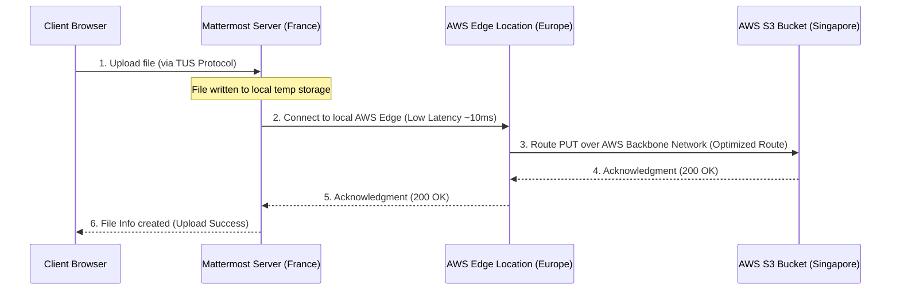

# S3 Storage Acceleration for Mattermost Uploads: Guideline & Technical Report

This guide outlines the architecture, performance benefits, and step-by-step configuration for accelerating file transfers between the Mattermost server (France) and your S3 bucket (Singapore) using **S3 Transfer Acceleration** (Option A) and **AWS CloudFront** (Option B).

---

## Option A: AWS S3 Transfer Acceleration (Recommended)

S3 Transfer Acceleration is the most robust and simplest approach. It routes S3 uploads/downloads through AWS's optimized global network edge locations. The server in France connects to the nearest AWS edge node, and the upload is accelerated over AWS's private network backbone to Singapore.



### Why Option A is optimal:
- **No Resource Management:** It requires **no new resource provisioning** (such as CloudFront distributions) or custom request policy configurations.
- **Zero Signature Issues:** It is natively supported by the AWS S3 SDK and Minio client. The Host header and signature validation are handled automatically by AWS.
- **Minimal Configuration:** Only a simple toggle in the AWS Console and a single environment variable change in `.env` are required.

### Step-by-Step AWS Console Guide
1. Open the **Amazon S3 console** at https://console.aws.amazon.com/s3/.
2. In the **Buckets** list, click on the name of your bucket: `artslab-collab-storage`.
3. Choose the **Properties** tab.
4. Scroll down to the **Transfer acceleration** card and click **Edit**.
5. Under *Transfer acceleration*, select **Enable**.
6. Click **Save changes**.
7. AWS will generate your accelerated endpoint, which follows this format: 
   `artslab-collab-storage.s3-accelerate.amazonaws.com`

---

## Option B: AWS CloudFront CDN Proxy (Alternative)

This option sets up an AWS CloudFront distribution to sit in front of the S3 bucket.

### S3 Signature & Host Header Caveats
AWS S3 uses **Signature Version 4** to authenticate write operations (PUT). If the Host header in the request forwarded by CloudFront does not match what the Mattermost server signed, S3 will reject the request with `SignatureDoesNotMatch`. Therefore, CloudFront must be configured to forward the original Host header and signature details.

### Step-by-Step AWS Console Guide
1. Open the **AWS CloudFront Console**.
2. **Create Origin Request Policy:**
   - Under *Telemetry & settings*, choose **Policies**, then click **Origin request**.
   - Click **Create origin request policy**.
   - **Name:** `S3-Upload-Preserve-Headers`
   - **Headers:** Choose **Include the following headers** and add:
     - `Host`
     - `Authorization`
     - `x-amz-content-sha256`
     - `x-amz-date`
     - `x-amz-storage-class`
   - **Query strings & Cookies:** Select **All**.
   - Click **Create**.
3. **Create CloudFront Distribution:**
   - Click **Distributions** in the left menu, then click **Create distribution**.
   - **Origin domain:** Select your S3 bucket endpoint: `artslab-collab-storage.s3.ap-southeast-1.amazonaws.com`
   - **Allowed HTTP methods:** Select `GET, HEAD, OPTIONS, PUT, POST, PATCH, DELETE`.
   - **Viewer protocol policy:** Select `Redirect HTTP to HTTPS`.
   - **Cache policy:** Select `CachingDisabled`.
   - **Origin request policy:** Select the `S3-Upload-Preserve-Headers` policy created in Step 2.
   - Click **Create distribution** and wait for it to deploy. Note the domain (e.g. `d123456abcdef8.cloudfront.net`).

---

## Mattermost Configuration Actions (For Option A or Option B)

Once the AWS-side configuration is complete, apply the changes to the Mattermost staging environment:

1. Open the staging `.env` file:
   ```bash
   nano /var/www/mattermost-collab-staging/.env
   ```
2. Modify the S3 endpoint configuration depending on your choice:
   - **For Option A (S3 Transfer Acceleration):**
     ```env
     MM_FILESETTINGS_AMAZONS3ENDPOINT=s3-accelerate.amazonaws.com
     ```
   - **For Option B (CloudFront CDN):**
     ```env
     MM_FILESETTINGS_AMAZONS3ENDPOINT=d123456abcdef8.cloudfront.net
     ```
3. Save and close the file.
4. Restart the Docker container stack to apply the environment changes:
   ```bash
   sudo docker compose -f /var/www/mattermost-collab-staging/docker-compose.staging.yml --env-file /var/www/mattermost-collab-staging/.env --project-name mattermost-staging up -d
   ```
5. Tail the container logs to verify Mattermost successfully connects and authenticates with S3:
   ```bash
   sudo docker compose -f /var/www/mattermost-collab-staging/docker-compose.staging.yml --env-file /var/www/mattermost-collab-staging/.env --project-name mattermost-staging logs --tail=50 mattermost
   ```
