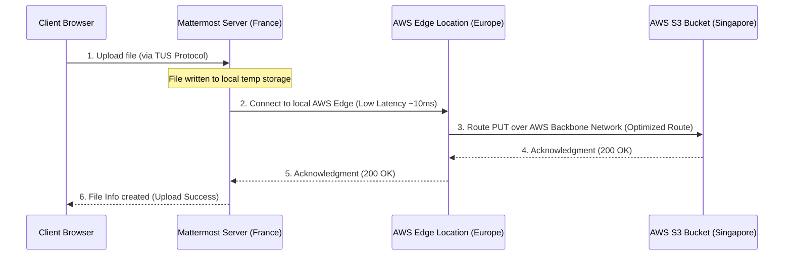

# Mattermost Fork: Collaborative Workspace (Staging & Production)

This repository is a customized, self-hosted fork of **Mattermost Community Edition (v11.4.0)**. It serves as a unified workspace featuring several custom-developed plugins, database optimizations, performance integrations, and developer-friendly utilities.

Staging Server URL: [staging.collab.artslabcreatives.com](https://staging.collab.artslabcreatives.com)

---

## 🚀 Quick Start & Deployment

### Full Rebuild & Deploy
To pull files, back up PostgreSQL, compile frontend and backend assets in parallel, and recreate the Docker containers, run:
```bash
sudo ./rebuild.sh
```

### Staging Deployment (Docker Compose)
To rebuild and start the staging stack directly:
```bash
sudo docker compose -f docker-compose.staging.yml up -d --build
```
Local staging port mapping: `http://localhost:8066` pointing to Mattermost port `8065`.

### Webapp Build (from `/webapp`)
```bash
npm install
npm run build --workspace=channels              # Production compile
npm run dev-server --workspace=channels         # Hot-reloading dev server
```

### Server Build (from `/server`)
```bash
make setup-go-work
make build-linux-amd64 BUILD_NUMBER=custom BUILD_TAGS="sourceavailable"
```

---

## 🛠️ Custom Developed Functionalities

We have custom-built and modified various aspects of the Mattermost webapp and server:

### 1. Download All Option (Multiple Attachments)
- **Features:** Installs a premium-styled "Download all" action button/link above file attachment lists or photo grids whenever a post contains more than one non-archived attachment.
- **Implementation:** Staggers downloads by 150ms to bypass browser multi-download security restrictions.
- **Code Reference:** [`file_attachment_list.tsx`](file:///var/www/mattermost-collab-staging/webapp/channels/src/components/file_attachment_list/file_attachment_list.tsx), [`_files.scss`](file:///var/www/mattermost-collab-staging/webapp/channels/src/sass/components/_files.scss).

### 2. Auto-Join Channels Plugin
- **Features:** Server-side plugin that automatically joins newly registered users to a set of predefined channels/teams.
- **Optimizations:** Filters out duplicate key and membership-already-exists errors to prevent hooks from breaking.
- **Code Reference:** `plugin-src/auto-join/`.

### 3. Zoho Mail Integration Plugin
- **Features:** Renders a custom dark-themed Zoho Mail interface directly inside the Mattermost Right-Hand Sidebar (RHS).
- **Implementation:** Supports folders, inline image link rewriting, attachment proxy, and uses a robust `/attachmentinfo` extractor.
- **Code Reference:** `plugin-src/zoho-mail/`.

### 4. Jothika Plugin
- **Features:** Integrates `jothika.artslabcreatives.com` within the RHS using a custom iframe and dedicated icon.
- **Code Reference:** `plugin-src/jothika/`.

### 5. Burn-on-Read (Self-Destructing) Posts
- **Features:** Client-side timed self-destructing messages, gated behind `FeatureFlags.BurnOnRead` on the Go server.
- **Code Reference:** `webapp/channels/src/hooks/useBurnOnReadTimer.ts`, `webapp/channels/src/utils/burn_on_read_expiration_scheduler.ts`.

### 6. Scoped Channel Search (Typesense)
- **Features:** An inline scoped local search bar in the channel header (`in:<channel>`) integrated with **Typesense** as a search engine backend.
- **Staging Typesense Container:** Port `8112`. Already indexes 42,000+ posts with schemas corrected.
- **Code Reference:** `server/enterprise/typesense/`, `webapp/channels/src/components/channel_header/channel_header.tsx`.

### 7. TUS Resumable Uploads & File Eviction fixes
- **Features:** Resumable image/file uploads at `/api/v4/files/tus/` using Uppy on the client.
- **Fixes:** Resolves concurrency race conditions between file upload creation and completion goroutines. Extends metadata cache lifetime to a 5-minute TTL to prevent premature evictions during temporary network interruptions.
- **Code Reference:** `server/channels/api4/tus_handler.go`.

### 8. Follow-up Bot Scheduled Reminders
- **Features:** Runs an hourly cron daemon checking for unanswered posts from the past 30 days and posts AI-powered polite follow-ups via OpenAI API.
- **Isolation:** Configured to run under the system account `aura` to prevent reminders from showing up as Sahan's own threads/unreads.
- **Code Reference:** `followup_scheduler.py`, `followup_reminded_threads.json`.

### 9. Modern Image & Video Previews
- **AVIF Previews:** Decoding failures for modern image formats gracefully fall back to native browser rendering instead of generating broken thumbnails.
- **Video Previews:** Enforces a clean, uniform 320x180 thumbnail preview format using `object-fit: cover`.

### 10. Email-Only Passwordless Login
- **Endpoint:** `POST /api/v4/users/login/email_only`
- **Body:** `{"email": "user@example.com", "redirect_to": "channel_id"}`
- **Security:** Community Edition build option; has no security checks. Only use in development or safe trusted environments.

---

## ⚡ AWS S3 Storage Acceleration

To accelerate file transfers between the Mattermost server (France) and S3 bucket (Singapore), configure one of the options below:

### Option A: AWS S3 Transfer Acceleration (Recommended)
This routes uploads through AWS's optimized edge locations directly over the AWS private backbone.



**AWS Console Setup:**
1. Open S3 properties for `artslab-collab-storage` bucket.
2. Under **Transfer acceleration**, click **Enable** and save.
3. Update `.env` to point to:
   ```env
   MM_FILESETTINGS_AMAZONS3ENDPOINT=s3-accelerate.amazonaws.com
   ```

### Option B: CloudFront CDN Proxy
Set up a CloudFront distribution cache pointing to your S3 bucket. You **must** create an Origin Request Policy forwarding headers (`Host`, `Authorization`, `x-amz-content-sha256`, `x-amz-date`, `x-amz-storage-class`) to prevent `SignatureDoesNotMatch` S3 errors.

---

## 🔍 Debugging & Log Monitoring

Use these utility commands to monitor container health and watch requests:

| Task | Command |
|---|---|
| **Live HTTP request logger** | `./watch-requests.sh` |
| **All staging logs** | `sudo docker compose -f docker-compose.staging.yml logs -f mattermost` |
| **Errors & Warnings only** | `sudo docker compose -f docker-compose.staging.yml logs -f mattermost 2>&1 \| grep -i "error\\|warn\\|fail"` |
| **Ping health check** | `curl -sf http://localhost:8065/api/v4/system/ping` |
| **Reset Admin Password** | `docker exec -it mattermost-server /mattermost/bin/mmctl user reset-password admin@example.com --config /mattermost/config/config.json` |

---

## 🔒 Security Best Practices
1. Ensure the staging/prod `POSTGRES_PASSWORD` is unique.
2. Force HTTPS redirects in Nginx reverse proxies.
3. Configure rate limiting and disable `login/email_only` in production environments.
